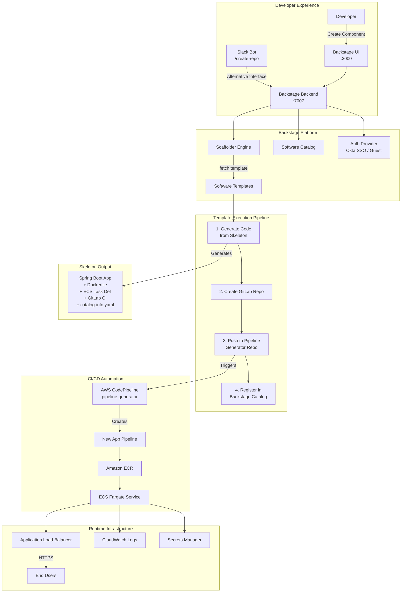
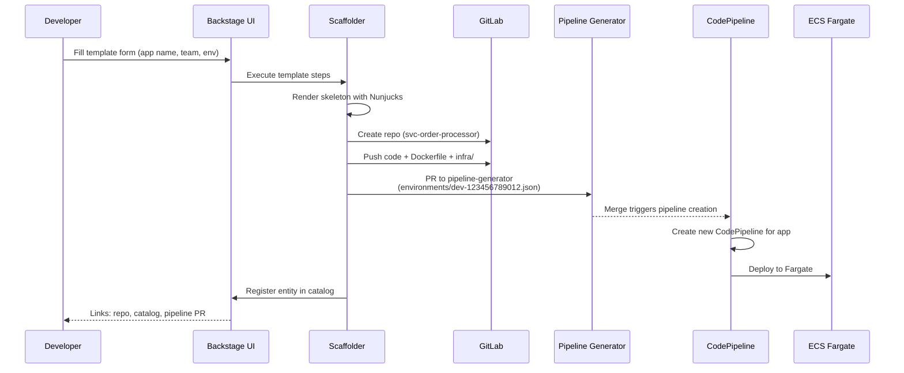

# Backstage Internal Developer Platform (IDP)

A production-grade [Backstage.io](https://backstage.io) Internal Developer Platform that automates microservice onboarding with self-service templates. Originally built for a payments enterprise running 150+ ECS Fargate services — this project demonstrates the full "golden path" workflow from developer request to running infrastructure.

## Architecture



## How It Works



## Project Structure

```
backstage-idp/
├── app-config.yaml              # Main Backstage configuration
├── app-config.production.yaml   # Production overrides
├── packages/
│   ├── app/                     # Frontend (React)
│   └── backend/                 # Backend (Node.js + Express)
├── plugins/                     # Custom Backstage plugins
├── templates/
│   └── ecs-springboot-service/  # Custom software template
│       ├── template.yaml        # Template definition (parameters + steps)
│       └── skeleton/            # Code scaffold
│           ├── src/             # Spring Boot application
│           ├── infra/           # ECS task + service definitions
│           ├── build.gradle     # Gradle build (Spring Boot 3.3)
│           ├── Dockerfile       # Multi-stage container build
│           ├── .gitlab-ci.yml   # CI/CD pipeline
│           └── catalog-info.yaml # Backstage entity registration
└── examples/                    # Default Backstage examples
```

## Template: ECS Spring Boot Microservice

The custom template (`templates/ecs-springboot-service/`) provisions:

| Component | Technology | Details |
|-----------|-----------|---------|
| Application | Spring Boot 3.3 + WebFlux | Reactive, non-blocking |
| Messaging | Apache Kafka | Event-driven architecture |
| Container | Eclipse Temurin JRE Alpine | Minimal attack surface |
| Compute | ECS Fargate | Serverless containers |
| Load Balancer | ALB | Path-based routing, health checks |
| CI/CD | GitLab CI → CodePipeline | Push-to-deploy |
| Observability | CloudWatch + Actuator | Structured logging, metrics |
| Secrets | AWS Secrets Manager | Injected at runtime |

### Template Parameters

- **appName** — Must match `svc-*` pattern (e.g., `svc-order-processor`)
- **team** — payments / ecommerce / fulfillment / platform
- **environment** — dev / cert / prod
- **awsAccountId** — 12-digit AWS account number
- **javaVersion** — 17 or 21

## Quick Start

### Prerequisites

- Node.js 22+ 
- Yarn (Berry/v4)

### Run Locally

```bash
# Install dependencies
yarn install

# Start development server (frontend :3000 + backend :7007)
yarn start
```

Open http://localhost:3000 → Click **"Create"** → Select **"ECS Microservice (Spring Boot + Fargate + ALB)"**

### Production Deployment (ECS Fargate)

```bash
# Build the backend Docker image
yarn build:backend
yarn build-image

# Push to ECR and deploy
docker tag backstage:latest <account>.dkr.ecr.<region>.amazonaws.com/backstage:latest
docker push <account>.dkr.ecr.<region>.amazonaws.com/backstage:latest
```

## Configuration

Key settings in `app-config.yaml`:

| Setting | Value | Purpose |
|---------|-------|---------|
| `app.title` | Platform Engineering IDP | Branding |
| `backend.database` | better-sqlite3 (dev) / PostgreSQL (prod) | Persistence |
| `auth.providers` | guest (dev) / Okta (prod) | Authentication |
| `catalog.locations` | file-based templates | Service discovery |

## Tech Stack

- **Backstage** — CNCF Internal Developer Platform framework
- **React** — Frontend UI
- **Node.js + Express** — Backend API
- **SQLite** (dev) / **PostgreSQL** (prod) — Catalog database
- **Nunjucks** — Template rendering engine
- **Rspack** — Frontend bundler

## License

Internal use — Platform Engineering team.
